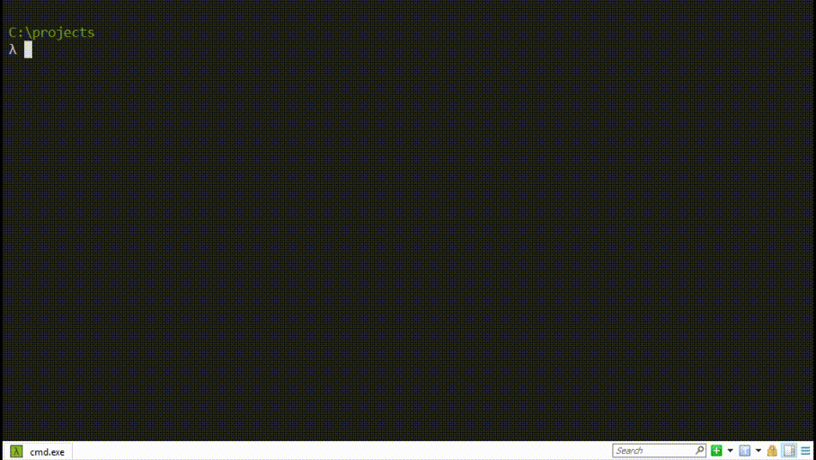

# Build environments [](https://www.npmjs.com/package/code-template-generator)
You can download [code-template-generator](https://www.npmjs.com/package/code-template-generator) that is a part of this project on npmjs.com.

## For the next generation (version 2) [](https://www.npmjs.com/package/code-template-generator/v/alpha)

Restructure
- [x] Code refactoring.
- [ ] Remove Babel 6 template.

Performance - UX:
- [x] Improve performance
- [x] Easier to install and use
- [x] More consequence
- [x] Friendly error message or help information

New features:
- [x] `-g`: New argument to run `git init` automatic while generate the template.
- [x] `-c`: New argument to generate a React component file (*.js | *.jsx) in the current directory.
- [ ] `-r`: New argument to generate a React-Redux component file (*.js | *.jsx) in the current directory.
- [x] `-i`: New argument to generate a `.gitignore` file in the current directory.

Breaking changes:
- [x] The `git` support option.
    * Version 1: `$ generate react-counter git`
    * Version 2: `$ generate -g react-counter`
- [x] Requirement for Nodejs is >= version 8.0.0

#### Installation:
`$ npm i -g code-template-generator@alpha`

#### Using for version 2
`$ generate [option] <project-name>[<component-name>]`

| Argument | Used with | Description |
|:---:|:---:|---|
| `<project-name>` | - |  Generate a new project by the selected code template (withou Git support) |
|`-g`|`<project-name>`| Git is installed automatically (`git init`) and a `.gitignore` file is also created on the root of work directory while a new project is generated|
|`-c`|`<component-name>`|It will be generate a component in the current directory `(js, jsx)` and you decide its name|
| `-i` |-| A `.gitignore` file will be generated in the current directory |
|`-v`|-|View the installed version|
|`-help`|-|View the help information|

Example:
````
$ generate new-project
$ generate -g other-project
$ generate -i
$ generate -c ListComponent.js
$ generate -c OtherComponent.jsx
$ generate -v
$ generate -help
````

## Table of contents (version 1)
* [What's new](#whats-new)
* [Features](#features)
* [Screenshot](#screenshot)
* [Installation](#installation)
* [Using](#using)
* [Work directory](#work-directory)
* [Example](#example)
* [Tips and tricks for these code templates](#tips-and-tricks)
    * [How can I check for outdated, incorrect, and unused dependencies?](#1-how-can-i-check-for-outdated-incorrect-and-unused-dependencies)
    * [How can I config Webpack Dev Server for React-Router v4?](#2-how-can-i-config-webpack-dev-server-for-react-router-v4)
    * [How can I use async/ await in React?](#3-how-can-i-use-async-await-in-react)
    * [How can I work with HTML5 responsive behaviors?](#4-how-can-i-work-with-html5-responsive-behaviors)
    * [How can I passed the CORS?](#5-how-can-i-passed-the-cors)
    * [How can I know about supported web browser?](#6-how-can-i-know-about-supported-web-browser)
    * [How can I use code splitting in React?](#7-how-can-i-use-code-splitting-in-react)

## What's new
* From version 1.4.0: code-template-generator will show a message when the new version is available on npmjs.com.


## Features
* It's simple to config what you want and install the dependencies you need.
* Supported:
    * Code splitting.
    * Image handling.
    * CSS, JS code injected automatic into HTML template.
    * .gitignore handling.
    * Hot Module Replacement (HMR) enabled for CSS.
* You don't need to care about the distribution (publish) directory.
* Automatic update check and show a message when the new version is available on npmjs.com.

#### Detail information
||react-babel-6|react-babel-7|react-code-splitting|react-typescript-3
|---|:--:|:--:|:--:|:--:|
|Programming language|JS|JS|JS|TS|
|TypeScript|-|-|-|v3|
|Babel core|v6|v7|v7|-|
|Babel Loader|v7|v8|v8|-|
|Config file|.babelrc|.babelrc|babel.config.js|tsconfig.json|
|All needed dependencies are installed automatic|X|X|X|X|
|Auto refresh whenever you make a change in your code|X|X|X|X|
|CSS, JS files injected automatic into the HTML template file `index.html`|X|X|X|X|
|Distribution directory `./dist` is deleted and then created automatic during the app building|X|X|X|X|
|Using `.browserslistrc`|X|X|X|X|
|`.gitignore` handling|X|X|X|X|
|Image handling|-|-|X|-|
|Code splitting|-|-|X|-|
|Support async/ await|-|-|X|-|
|Hot Module Replacement (HMR) enabled for CSS|-|-|X|-|

TIP! You should be carefully before you want update these packages which founded in package.json to newer versions.

## Screenshot


## Installation
Installed [Inquirer.js](https://www.npmjs.com/package/inquirer) is requirement before the code-template-generator installation:
* `$ npm i -g inquirer`

When you have already installed Inquirer.js:
* `$ npm i -g code-template-generator`

## Using
`$ generate <project-name> [option]`

| Argument | Requirement | Description |
|---|---|---|
| `<project-name>` | Required | Generate a project by a selected template |
| `git` | Option | A `.gitignore` file will be created automatically on the root of project directory |
|`-v`|Option|View the installed version|
|`-help`|Option|View the help information|

## Work directory
````
/
|--dist
|--src
|   |--images
|   |--index.html
|   |--index.js
|   |--...
|--package.json
|--...
````
Your application is within the `/src` directory:
* `images` directory is using to store all images are used in your application.
* `index.html` is the main HTML template.
* `index.js` is the main entry point for your code.

You don't need to care about the `/dist` directory (distribution/ publish). It is deleted and then created automatic during the application building when you run the command `npm start` or `npm run build`.

[Go to top](#build-environments-)

## Example
````
$ generate react-todo
$ generate react-counter git
$ generate -v
$ generate -help
````

## Tips and tricks
#### 1. How can I check for outdated, incorrect, and unused dependencies?

Using [npm-check](https://www.npmjs.com/package/npm-check). It's amazing! (^_~)

[Go to top](#build-environments-)

#### 2. How can I config Webpack Dev Server for React-Router v4?

Add these code to Webpack config files:

_webpack.common.js_
````
output: {
    ...
    publicPath: '/'
    ...
}
````

_webpack.dev.js_
````
devServer: {
    ...
    historyApiFallback: true
    ...
}
````
[Go to top](#build-environments-)

#### 3. How can I use async/ await in React?

Add these code to Babel config file (`.babelrc` or `babel.config.js`):
````
"presets": [
        [
            "@babel/preset-env", 
            {
                "targets": 
                    {
                        "node": "10"
                    }
            }
        ],
        ...
    ]
````

Example

````
import React, { Component } from 'react';

class Menu extends Component {
    async handleClick() {
        const fetchURL = 'your_url_here';
        const response = await fetch(fetchURL);
        await response.json()
                .then((collection) => {
                    console.log(collection);
                });
        
    }

    render() {
        ...
    }
}
````
[Go to top](#build-environments-)

#### 4. How can I work with HTML5 responsive behaviors?
Using this HTML code in your HTML file:
````
<meta name="viewport" content="width=device-width, initial-scale=1, shrink-to-fit=no">
````
[Go to top](#build-environments-)

#### 5. How can I passed the CORS?
You may want to view about [Cross-Origin Resource Sharing (CORS)
](https://developer.mozilla.org/en-US/docs/Web/HTTP/CORS) on MDN and here is a little recomendation for `index.html`:
````
<meta http-equiv="Content-Security-Policy"
        content="default-src * 'unsafe-inline' 'unsafe-eval'; 
                script-src * 'unsafe-inline' 'unsafe-eval' 'self'; 
                connect-src * 'unsafe-inline'; 
                img-src * data: blob: 'unsafe-inline'; 
                frame-src *; 
                style-src * 'unsafe-inline';">
````
[Go to top](#build-environments-)

#### 6. How can I know about supported web browser?

Run `npx browserslist` in project directory to see what browsers was selected by your queries.

You may want to view about [Browserslist here](https://github.com/browserslist/browserslist) and then you can change the default config in this file `/.browserslistrc`.

[Go to top](#build-environments-)

#### 7. How can I use code splitting in React?
You may want to view these things:
* [React guide](https://reactjs.org/docs/code-splitting.html).
* The simple example [here](https://github.com/nguyenkhois/react-code-splitting-example).

[Go to top](#build-environments-)